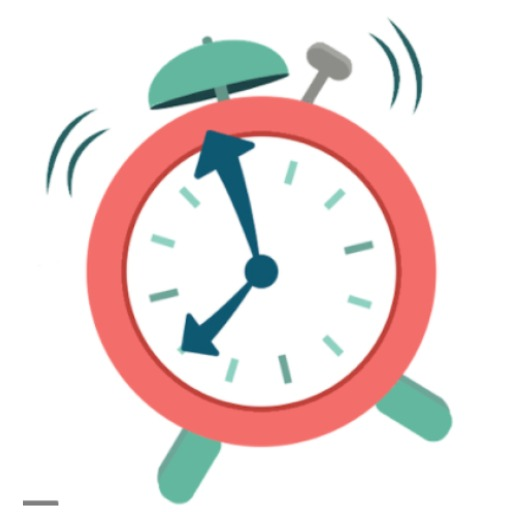

## App Logo

## App Name : WeRemindYou
-  WeRemindYou app can be used to set reminders for the tasks for which they want to be reminded later.
- users can set the reminders priority wise like high,medium,low.Also set the reminders based on current location, and create the reminders in specific date and time without enabling it.

## Team Information: 
<table>
<td align="center"><a href="https://github.com/rohith0696"> <b>Rohith Chittimalla</b></a> </td>
 <td align="center"><a href="https://github.com/nrajubn"> <b>Raju Nooka</b></a> </td>
 <td align="center"><a href="https://github.com/Teju2404"> <b>Tejaswi Reddy Kandula</b></a> </td>
 <td align="center"><a href="https://github.com/GUNDUPOOJA"> <b>Pooja Gundu</b></a> </td>
 </table>

## Problem/Issue App is going to address:

Users can keep the track of their day to day tasks. We Remind You app can be used to set reminders for the tasks which they want to be reminded later. User can create the remainders without enabling it, they can set the remainders in specific date and time. In this application the users can also keep their locations in the reminders. Users can also set their reminder in priority wise so that the highest priority reminders could be done first and then later the medium and low priorities will be done. We Remind You app helps to manage your life easily.

##  Introduction:

- We have a lot of things to do every day, doing housework, company work, meetings, birthday parties, phone calls, billings, television shows, etc. Memorizing everything and managing it well is not easy, so a remainder app will be very helpful to manage all the things.  
- Reminder app is a simple event management application in which we can set the remainders with priorities like high,medium,low. And also, we can set the remainders based on location.There will be pop-up window alerts and sound to make sure you don't miss any important event.

## Application Sequence Information:
- Application opens up with a main page where the user can set the reminder by clicking on New Reminder button.
- After clicking on the New Reminder, create reminder page shows up where the user can create the reminder by entering the details like reminder name, a checkbox to enable or disable it, select the date,time and location and also choose the priority like medium,high,low.
- There is also an alarm that will snooze for every 10 minutes that reminds the user about the reminder.
- There are colors for the priority that will differentiate between the high,medium, and low reminders as choosen by the user, i.e Green color for high priority,Red for low, Yellow for green.
- In the dashboard menu,there are about Us and rateus options, about Us mainly tells about how the app works, rate Us option allows users to rate the application.

## Layouts: 
## Main Activity: 

- It is the dashboard which shows the screen having menu bar for selecting Dashboard, Help, Rate US, and Exit.
-	We also have a button to create new remainder which takes us to the create remainder activity.

  
## Create Remainder Activity:

- Here the new remainder is created.
- It consists of EditText where we will take the name/description of the remainder.
- A checkbox for enable or disable the remainder.
- One button to set the date.
- One button to set the time.
- One button “Done” to set the remainder.
- One button to cancel the remainder.

  
  
## Task List Activity:

- It shows the dashboard and it also consists of list view where all the remainders can be seen.
- Here in the list view we can see the remainder with date, time and we can also have buttons to edit and delete the remainder.  

  
  
## Ringing Activity:

- It shows the page when the remainder is set and alarm ringing.
- It shows the name/description of the remainder in TextView.
- It also consists a button to dismiss the alarm which takes back to the dashboard.

  
## Menu Bar Activity:

- In this the activity for the menu bar will be present which shows Dashboard, Help, Rate Us and Exit. 
- In this it navigates the screen by clicking on different items in the menu.  

  

## Supported Devices
- only works in android devices
- Android 5.0(Lollipop) and above versions.
- Minimum sdk version 21 and target sdk version 29.

## Database:
- We are using SQlite database for our android application. 
- SQLite stores the data in structured manner. SQLite has higher performance.
- SQLite databases can also be queried and the data retrieval is much more robust.
- we are using this database to store the reminders,date,time,days, priorities,alarm and the timer.

## Instructions to run this application locally:
- Always Get fresh code.
- pull the fresh code(Fork and clone if this is the first time).

## Steps for cloning repository using command line
1. on github repo, navigate to the main page of the repository.
2. click on the Code button on main page repository.
3. After clicking on code, we can clone using HTTPS or SSH.Click on the respective tab and copy the URL provided.
4. Now open Git bash(some tools need to be installed like tortoisegit,gitbash)
5. change the current working directory where we want the cloned directory.
6. Type "git clone" and then paste the URL which was copied earlier.
7. press "Enter"to create your local clone.
8. Then open this folder using "Android studio" and then run this app using emulator.

## References :
- [For adding API key](https://youtu.be/0ZSg58AV8r8)

## Persist:

Once the user sets the reminder for alarm and after dismissing it still the user can view the remainder in the dashboard add they can edit or delete that remainder. 

 
  
  
